# 🚁 MADMAX AI Agentic Aerial Robotics

[](https://opensource.org/licenses/MIT)
[](https://www.python.org/downloads/)
[](https://ardupilot.org/)
[](https://developer.nvidia.com/embedded/jetson-orin-nano-developer-kit)

**Next-Generation AI-Powered Drone Control System**

> *"Just tell your drone what to do in plain English, and watch it execute complex missions autonomously."*

MADMAX revolutionizes drone control by combining cutting-edge AI agents, natural language processing, and computer vision into a unified autonomous aerial robotics platform. Built for the NVIDIA Jetson Orin Nano and Pixhawk 6C, it transforms simple voice commands into intelligent flight missions.


---

## 🌟 Key Features

### 🧠 **AI-Powered Intelligence**
- **Natural Language Processing**: Command your drone using everyday language - *"Take off to 50 meters and search for red vehicles"*
- **AI Agent Planning**: Multi-agent system with safety officers, mission planners, and execution monitors
- **Computer Vision**: YOLOv8-powered object detection and tracking for autonomous target identification
- **Intelligent Mission Planning**: Pre-planned waypoint missions with dynamic route optimization

### 🚁 **Advanced Flight Capabilities**
- **Autonomous Mission Execution**: Pre-programmed flight patterns and search operations
- **Real-time Object Detection**: Identify and track specific targets during flight
- **GPS Coordinate Logging**: Precise location recording for detected objects
- **Multi-Mission Support**: Takeoff, landing, waypoint navigation, search patterns, and survey missions

### 📡 **Communication & Telemetry**
- **Dual Communication**: Primary MAVLink + Secondary LoRa for extended range
- **Long-Range LoRa**: Up to 10km communication range for remote operations
- **Real-time Telemetry**: Live GPS, battery, altitude, and system status monitoring
- **Target Alert System**: Instant notifications when objects are detected

### 🛡️ **Safety & Reliability**
- **Multi-layer Safety Checks**: AI-powered risk assessment before mission execution
- **Emergency Stop System**: Immediate flight termination capabilities
- **Failsafe Integration**: Automatic return-to-launch on communication loss
- **Geofencing**: Configurable flight boundaries and altitude limits

### 💻 **Modern Interface**
- **Real-time Web Dashboard**: Beautiful, responsive interface with live telemetry
- **WebSocket Integration**: Instant updates and command feedback
- **Mobile Responsive**: Control from any device with a web browser
- **Mission Visualization**: Live flight path and target detection display

## 🏗️ System Architecture

```mermaid
graph TD
    A[👤 User] -->|"Search for red vehicles"| B[🌐 Web Interface]
    B -->|NLP Command| C[🧠 AI Agent System]
    C -->|Mission Plan| D[📡 MAVLink Interface]
    D -->|Commands| E[🎛️ Pixhawk 6C]
    E -->|Flight Control| F[🚁 Hexacopter]
    F -->|Computer Vision| G[📷 Object Detection]
    G -->|Target Found| H[📡 LoRa Alert]
    H -->|Long Range| B
```



## 🎯 Demo Examples

### **Natural Language Commands**
```bash
# Basic Flight Operations
"Take off to 15 meters altitude"
"Land at current position"
"Return home immediately"
"Hover in place for 2 minutes"

# Navigation Commands
"Fly to coordinates 37.7749, -122.4194"
"Move north 100 meters at 20 meter altitude"
"Follow GPS waypoints from mission file"

# Advanced Missions
"Search for red vehicles in a 500m radius"
"Survey the agricultural field at 50m altitude"
"Patrol the perimeter for 10 minutes"
"Track the moving target and maintain 30m distance"
```

### **Object Detection Capabilities**
- **Vehicle Detection**: Cars, trucks, motorcycles with color classification
- **Person Detection**: Human detection and tracking for search & rescue
- **Infrastructure**: Buildings, bridges, power lines for inspection
- **Agricultural**: Crop health monitoring, livestock counting
- **Custom Objects**: Train custom YOLOv8 models for specific targets

### Core Components

1. **NLP Intent Extractor** (`ai_agents/nlp_intent_extractor.py`)
   - Processes natural language commands
   - Extracts flight intentions and parameters
   - Supports commands like "take off to 10 meters", "move to coordinates", etc.

2. **Flight Agent** (`ai_agents/flight_agent.py`)
   - AI-powered mission planning using CrewAI framework
   - Safety assessment and risk evaluation
   - Converts intentions to MAVLink command sequences

3. **MAVLink Interface** (`ai_agents/mavlink_interface.py`)
   - Real-time communication with Pixhawk 6C
   - Telemetry monitoring and command execution
   - Emergency stop and safety override capabilities

4. **Agentic Controller** (`ai_agents/agentic_controller.py`)
   - Main orchestrator for the entire system
   - Coordinates NLP, AI agents, and MAVLink communication
   - Manages mission execution and system state

5. **Web Interface** (`madmax_agentic_webserver.py` + `agentic_dashboard.html`)
   - Real-time dashboard with Socket.IO
   - Natural language command interface
   - System monitoring and telemetry display

## 🛠️ Hardware Requirements

### **Core Components**
| Component | Specification | Purpose |
|-----------|---------------|----------|
| **Computing Unit** | NVIDIA Jetson Orin Nano (8GB) | AI processing, computer vision |
| **Flight Controller** | Pixhawk 6C with ArduPilot | Flight control, sensor fusion |
| **Frame** | Hexacopter (6 motors) | Stable platform for payload |
| **Communication** | LoRa 915MHz modules | Long-range telemetry |
| **Camera** | USB 3.0 or CSI camera | Object detection, FPV |
| **GPS** | u-blox M8N or better | Precision navigation |

### **Optional Enhancements**
- **Gimbal**: 3-axis stabilized camera mount
- **LiDAR**: For advanced obstacle avoidance
- **RTK GPS**: Centimeter-level positioning accuracy
- **Companion Computer**: Raspberry Pi for redundancy

## 🚀 Quick Start

### 1. Hardware Assembly

```bash
# Connect components:
# 1. Jetson Orin Nano ←→ USB ←→ Pixhawk 6C
# 2. LoRa module ←→ UART ←→ Jetson GPIO
# 3. Camera ←→ USB 3.0 ←→ Jetson
# 4. Power distribution to all components
```

### 2. Software Installation

```bash
# Clone and navigate to MADMAX directory
cd /path/to/madmax

# Run automated setup
python3 setup_madmax.py

# Edit configuration
cp .env.example .env
nano .env  # Configure your MAVLink connection and API keys
```

### 3. Launch System

```bash
# Start MADMAX system
./start_madmax.sh

# Or run directly
python3 madmax_agentic_webserver.py
```

### 4. Access Web Interface

Open your browser and navigate to: **http://localhost:5000**

## 💬 Natural Language Commands

MADMAX understands a wide variety of natural language commands:

### Basic Flight Commands
- `"Take off to 10 meters"`
- `"Land safely"`
- `"Hover in place for 30 seconds"`
- `"Return home"`

### Navigation Commands
- `"Move to coordinates 47.641468, -122.140165"`
- `"Fly to coordinates 47.641, -122.140 at altitude 20 meters"`
- `"Go north 50 meters"`

### Advanced Maneuvers
- `"Orbit around current position with radius 20 meters"`
- `"Patrol the area for 5 minutes"`
- `"Survey the field at 30 meters altitude"`

### System Commands
- `"Arm the drone"`
- `"Disarm the drone"`
- `"Set flight mode to guided"`
- `"Emergency stop"`

## 🔧 Configuration

### Environment Variables (.env)

```bash
# MAVLink Connection (adjust for your setup)
MAVLINK_CONNECTION=/dev/ttyUSB0  # or /dev/ttyACM0 for Pixhawk 6C
MAVLINK_BAUD_RATE=57600

# OpenAI API (optional - enables advanced AI features)
OPENAI_API_KEY=your_api_key_here

# Safety Limits
MAX_ALTITUDE=120  # meters
MAX_SPEED=20      # m/s
MIN_BATTERY=20    # percentage
```

### MAVLink Connection Options

- **USB Serial**: `/dev/ttyUSB0` or `/dev/ttyACM0`
- **Network UDP**: `udp:192.168.1.100:14550`
- **SITL Testing**: `tcp:127.0.0.1:5760`

## 🛡️ Safety Features

- **Altitude Limits**: Enforces FAA 120m altitude limit
- **Speed Limits**: Prevents excessive speeds
- **Battery Monitoring**: Warns on low battery
- **GPS Requirements**: Ensures GPS lock before flight
- **Emergency Stop**: Immediate flight termination
- **Pre-flight Checks**: Automated safety checklist

## 🧠 AI Agent Framework

MADMAX uses CrewAI for intelligent mission planning:

- **Safety Officer Agent**: Assesses flight risks
- **Mission Planner Agent**: Creates detailed flight plans
- **Execution Monitor Agent**: Monitors flight progress

### Agent Capabilities

- Risk assessment and safety validation
- Intelligent waypoint planning
- Weather and airspace consideration
- Battery life estimation
- Contingency planning

## 📊 Web Dashboard Features

- **Real-time Telemetry**: Battery, GPS, altitude, speed
- **System Status**: AI components, MAVLink connection
- **Command Interface**: Natural language input
- **Mission Tracking**: Active and completed missions
- **System Logs**: Detailed operation logging
- **Emergency Controls**: Quick stop and reconnect

## 🔌 Hardware Integration

### NVIDIA Jetson Orin Nano
- Edge AI processing for NLP and agent frameworks
- Real-time telemetry processing
- Computer vision capabilities (future)
- Low-latency command execution

### Pixhawk 6C Flight Controller
- MAVLink protocol communication
- Flight control and stabilization
- Sensor fusion and navigation
- Safety and failsafe systems

## 📁 Project Structure

```
madmax/
├── ai_agents/                    # AI agentic components
│   ├── nlp_intent_extractor.py  # Natural language processing
│   ├── flight_agent.py          # AI mission planning
│   ├── mavlink_interface.py     # Flight controller communication
│   └── agentic_controller.py    # Main system orchestrator
├── madmax_agentic_webserver.py  # Web server and API
├── agentic_dashboard.html       # Web dashboard interface
├── setup_madmax.py              # Automated setup script
├── start_madmax.sh              # System startup script
├── requirements.txt             # Python dependencies
├── .env.example                 # Configuration template
└── README.md                    # This file
```

## 🧪 Testing

### SITL Simulation Testing

```bash
# Start ArduPilot SITL
sim_vehicle.py -v ArduCopter --console --map

# Configure for SITL testing
export MAVLINK_CONNECTION=tcp:127.0.0.1:5760

# Run MADMAX
python3 madmax_agentic_webserver.py
```

### Hardware Testing

1. Connect Pixhawk 6C via USB
2. Configure `.env` with correct serial port
3. Ensure drone is in safe testing environment
4. Start with basic commands: "arm", "take off to 2 meters"

## 🚨 Troubleshooting

### Common Issues

1. **MAVLink Connection Failed**
   - Check USB connection and port permissions
   - Verify correct device path in `.env`
   - Try different baud rates

2. **NLP Not Working**
   - Install spaCy model: `python -m spacy download en_core_web_sm`
   - Check internet connection for transformer models

3. **AI Agent Errors**
   - Verify OpenAI API key (optional)
   - Check CrewAI installation
   - Review system logs

### Log Files

- System logs: `logs/madmax.log`
- Web server logs: Console output
- MAVLink logs: Integrated in system logs

## 🔮 Future Enhancements

- **Computer Vision**: Object detection and tracking
- **LIDAR Integration**: Advanced obstacle avoidance
- **Multi-drone Coordination**: Swarm intelligence
- **Voice Commands**: Speech-to-text integration
- **Mobile App**: Remote control via smartphone
- **Machine Learning**: Adaptive flight behavior

## 📄 License & Attribution

**MIT License** - Free for commercial and personal use

### Third-Party Components
- **ArduPilot**: GPLv3 License
- **YOLOv8**: AGPL-3.0 License  
- **OpenCV**: Apache 2.0 License

## 🤝 Contributing & Community

### Development Team
- **Lead Developer**: [Your Name] - AI Systems & Flight Control
- **Computer Vision**: Advanced object detection and tracking
- **Hardware Integration**: Jetson Orin Nano optimization

### How to Contribute
```bash
# Fork the repository and create a feature branch
git checkout -b feature/amazing-new-feature
# Make your changes and submit a pull request
```

## 🏆 Acknowledgments

- **NVIDIA** for Jetson platform support
- **ArduPilot** community for flight control expertise  
- **Open source AI community** for model development

---

## ⚠️ Safety & Legal Notice

**IMPORTANT**: This system is designed for research and educational purposes. Always:
- ✅ Follow local aviation regulations (FAA Part 107, EASA, etc.)
- ✅ Maintain visual line of sight during operations
- ✅ Test in safe, controlled environments
- ✅ Ensure proper insurance coverage
- ✅ Respect privacy and no-fly zones

**The developers assume no liability for accidents or damages.**

---

<div align="center">

# 🚁 **MADMAX AI Agentic Aerial Robotics**

**The Future of Autonomous Drone Control is Here**

[](https://github.com/yourusername/madmax-ai-agentic-aerial-robotics)
[](https://twitter.com/madmax_ai)

*Built with ❤️ for the drone community*

</div>
